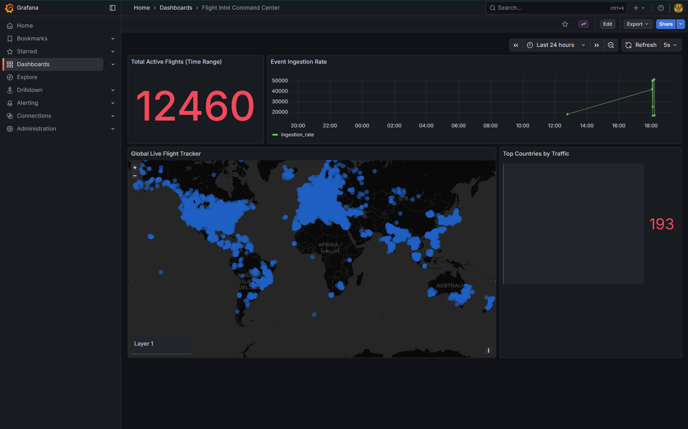

# Global Flight Intelligence Pipeline ✈️

A real-time, end-to-end data engineering pipeline capturing, processing, and visualizing global flight movements in real-time. This project was built to showcase modern streaming architecture, distributed data processing, and analytical storage at scale.

---

## Architecture Stack

 <!-- Just an example logo space -->

1. **Data Source**: Live flight vectors from the [OpenSky Network API](https://opensky-network.org/).
2. **Data Ingestion (Producer)**: A **Golang** service that periodically polls the API and publishes raw flight data to Kafka.
3. **Message Streaming**: **Apache Kafka** (running in KRaft mode) handles high-throughput messaging, decoupling ingestion from storage.
4. **Data Processor (Consumer)**: A second **Golang** application reads from Kafka and buffers the data.
5. **Analytical Database**: **ClickHouse**, a blazing-fast open-source column-oriented database management system. The Go consumer uses bulk inserts to write thousands of rows efficiently.
6. **Data Visualization**: **Grafana** connects to ClickHouse via the native plugin to render live geomaps, time-series charts, and gauges of active flights.

## Features

* **Real-time Geomapping**: Visualizing aircraft longitude/latitude, altitude, and speed on a live world map.
* **Efficient Storage schema**: ClickHouse tables are optimized with `MergeTree` engines for high-speed timeseries ingestion.
* **Automated Provisioning**: Grafana data sources and dashboards are provisioned via code (Infrastructure as Code approach), letting you spin up the entire stack with zero manual UI configuration.
* **Concurrent Go Processing**: Showcasing Goroutines, context management, and graceful shutdown patterns.

## Setup guide

### Prerequisites
* Docker & Docker Compose
* Go 1.20+

### Running the Infrastructure
Start Kafka, ClickHouse, and Grafana:
```bash
docker compose up -d
```

### Running the Pipeline
Run the Kafka producer to fetch data:
```bash
go run cmd/producer/main.go
```

Run the Kafka consumer to insert data into ClickHouse:
```bash
go run cmd/consumer/main.go
```

### Viewing the Dashboard
Open your browser and navigate to `http://localhost:3000`. 
Log in with the default credentials (`admin`/`admin`). 
Navigate to **Dashboards > Flight Intel Command Center** to see the live flight data visualization!

## Dashboard Preview


